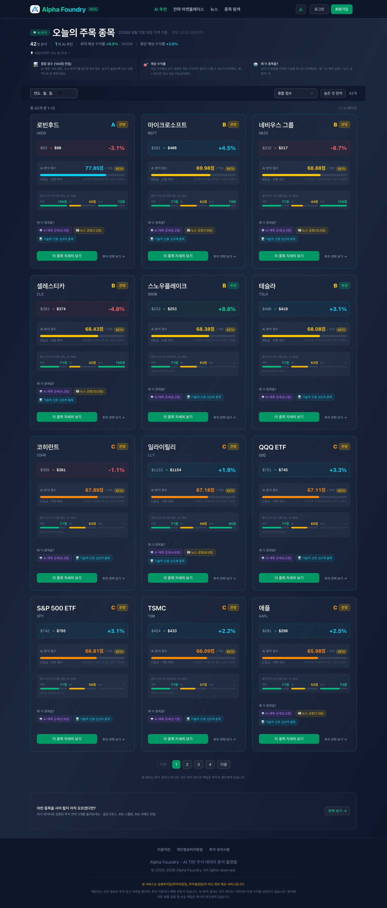
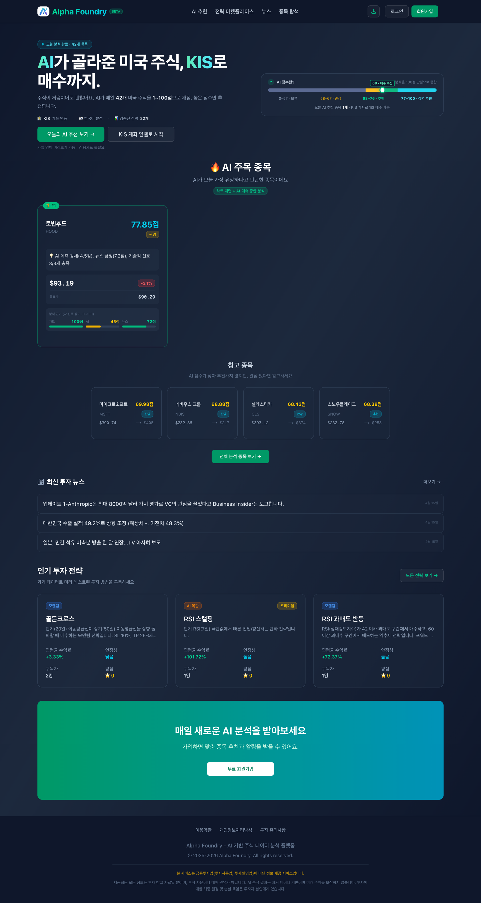
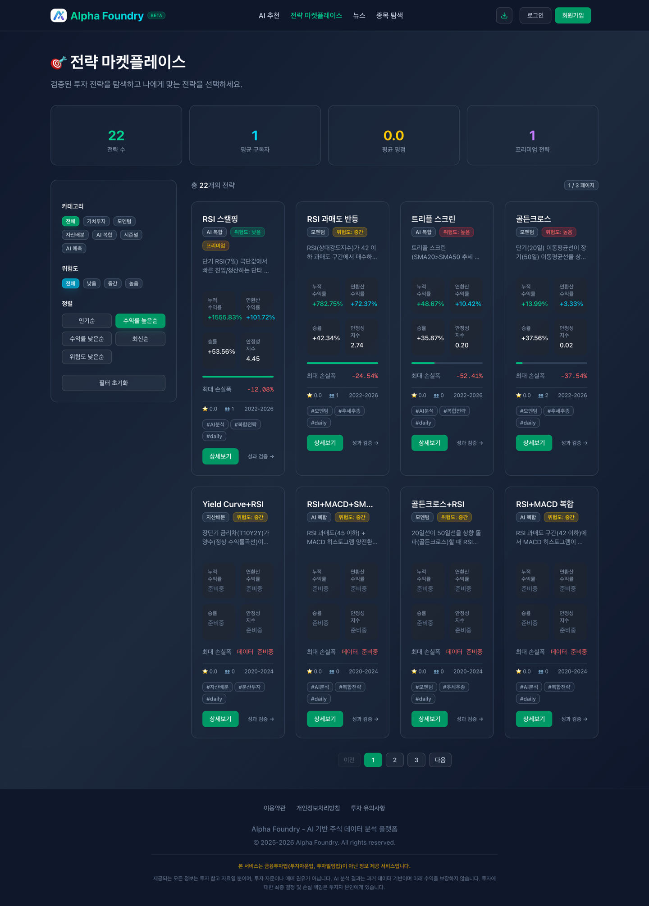
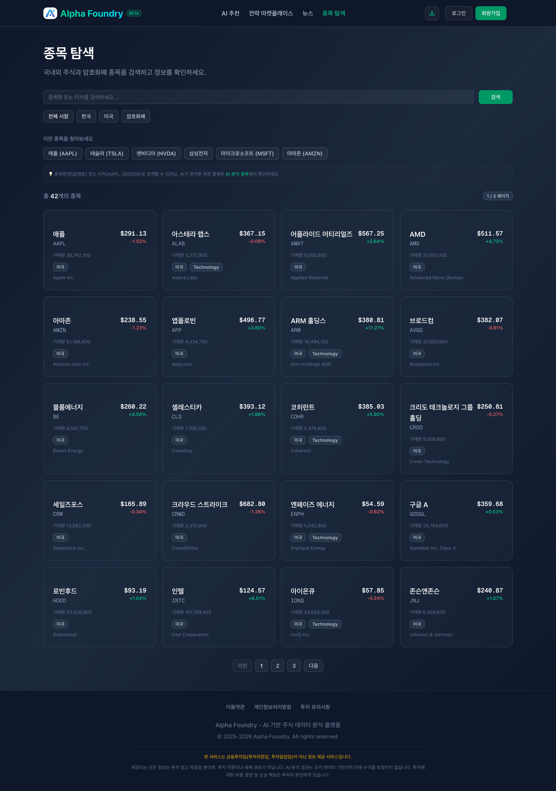
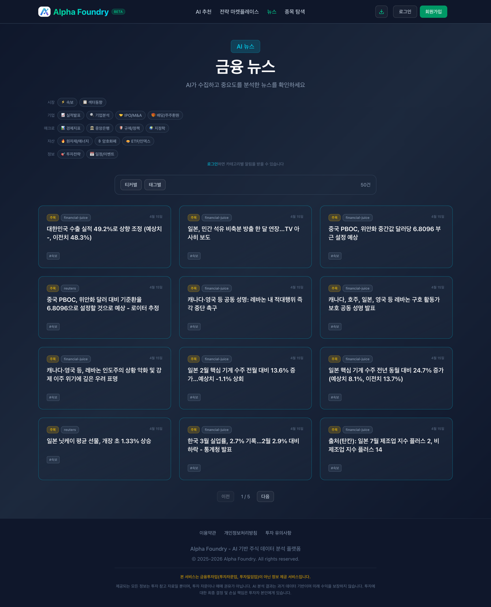

<div align="center">

# Alpha Foundry

### AI 기반 미국 주식 퀀트 분석 플랫폼

**기획 · 설계 · 개발 · 배포 · 운영을 1인 풀스택으로 구축한 프로덕션 서비스**

[](https://alphafoundry.app)
&nbsp;

&nbsp;


`Spring Boot` · `Kotlin` · `FastAPI` · `Python` · `Next.js` · `GCP Cloud Run` · `Vertex AI`

</div>

---

> ⚠️ **포트폴리오 공개용 저장소입니다.**
> 실제 운영 코드/시크릿은 비공개로 관리하며, 이 저장소는 프로젝트의 **아키텍처·기술 의사결정·구현 결과**를 정리한 쇼케이스입니다.
> 본 서비스는 금융투자업이 아닌 정보 제공 서비스이며, AI 분석 결과는 투자 권유가 아닙니다.

---

## 한눈에 보기

| 항목 | 내용 |
|---|---|
| **서비스** | AI가 미국 주식을 분석해 0~100점으로 점수화 → 추천·전략·뉴스 제공 ([alphafoundry.app](https://alphafoundry.app)) |
| **역할** | **1인 풀스택** — 기획, 백엔드, 데이터/ML, 프론트엔드, 인프라, 운영 전 영역 |
| **규모** | 4개 서비스 · 약 1,000 파일 · 100K+ LOC · 214 커밋 (2026.02 ~ 운영 중) |
| **아키텍처** | GCP Cloud Run 서버리스 (scale-to-zero) + Pub/Sub + Vertex AI |
| **운영비** | **월 약 $5** (서버리스 전환으로 ~$30 → ~$5, 83%↓) |
| **특징** | 회사 주력 스택(Spring Boot/Kotlin)을 **오너십 끝까지** 경험 + ML/인프라까지 확장 |

---

## 🖥️ 서비스 화면

### AI 추천 — 종목별 0~100 종합 점수 + 신호별 근거(XAI)
AI 예측 · 차트 패턴 · 뉴스 분위기를 **0~100점으로 정규화·가중합**하고, 각 신호의 강도(0~100)와 "왜 이 종목을?" 근거를 함께 제시합니다. (점수 모델은 [기술 의사결정 ②](#-점수-모델-ssot-재설계-adr-0006) 참고)



<table>
<tr>
<td width="50%">

### 홈 — AI 주목 종목 한눈에


</td>
<td width="50%">

### 전략 마켓플레이스 — 백테스트 기반 전략


</td>
</tr>
<tr>
<td width="50%">

### 종목 탐색 — 42개 종목 분석


</td>
<td width="50%">

### 금융 뉴스 — AI 수집·분류


</td>
</tr>
</table>

---

## 🏗️ 시스템 아키텍처

```
                          ┌─────────────────────────┐
   사용자 ─────▶  Cloudflare (DNS/CDN/WAF)  ─────▶ │   GCP Cloud Run         │
                          └─────────────────────────┘ │   (scale-to-zero)       │
                                                       │                         │
   ┌──────────────┐   ┌──────────────┐   ┌──────────────┐   ┌──────────────────┐
   │  Frontend    │   │  Backoffice  │   │  Core API    │   │  Data/ML Engine  │
   │  Next.js     │   │  Next.js     │   │ Spring Boot  │   │  FastAPI         │
   │  (사용자 웹) │   │  (운영자)    │   │  Kotlin      │   │  Python          │
   └──────────────┘   └──────────────┘   └──────┬───────┘   └────────┬─────────┘
                                                 │                    │
                          ┌──────────────────────┼────────────────────┤
                          │                       │                    │
                    ┌─────▼─────┐         ┌───────▼──────┐    ┌────────▼────────┐
                    │ PostgreSQL│         │   MongoDB    │    │  Pub/Sub        │
                    │ (Supabase)│         │  (Atlas)     │    │  (메시지 큐)    │
                    └───────────┘         └──────────────┘    └─────────────────┘
                                                              ┌─────────────────┐
   Cloud Scheduler ──(매일 23:05)──▶ Data Engine ──▶ Vertex AI│  (ML 예측)      │
                                                              └─────────────────┘
   외부: KIS API(시세) · FRED(경제지표) · yfinance(주가) · Toss(결제) · Slack(알림)
```

### 기술 스택

| 계층 | 기술 |
|---|---|
| **Core API** | Spring Boot 3.5, Kotlin 2.1, Java 21, Spring Security/OAuth2, JPA, GraalVM Native Image |
| **Data/ML Engine** | Python 3.11, FastAPI, Pandas/NumPy, Google Vertex AI, yfinance |
| **Frontend / Backoffice** | Next.js 15, React 19, TypeScript, Tailwind, Shadcn/ui |
| **Data Store** | PostgreSQL(Supabase), MongoDB(Atlas), Caffeine Cache |
| **Infra** | GCP Cloud Run, Pub/Sub, Cloud Scheduler, Terraform(IaC), GitHub Actions, Cloudflare |
| **Quality** | Kotest/MockK, pytest(200+), Vitest, Playwright(E2E), TestContainers |

---

## 🎯 핵심 기술 의사결정

> 모든 주요 결정은 **ADR(Architecture Decision Record)**로 근거와 함께 기록했습니다.

### ① 서버리스 전환으로 운영비 83% 절감 — ADR 0001 / 0003 / 0004

**문제** — 1인 운영 환경에서 Kafka+Zookeeper, Quartz Scheduler, GCE VM은 모두 **상시 가동 자원**을 요구해 비용·운영 부담이 큼 (VM 고정비 월 ~$30, 브로커 메모리 1GB+ 상시 점유).

**결정 & 실행**
- Kafka → **GCP Pub/Sub** (관리형, 사용량 과금) — *ADR 0001*
- Quartz → **GCP Cloud Scheduler** (QRTZ_* 테이블 11개·스레드풀 제거, 스케줄을 Terraform으로 관리) — *ADR 0003*
- GCE VM → **All Cloud Run** (4개 서비스 동일 배포 모델, `git push` → 자동 빌드·배포) — *ADR 0004*

**결과**
- 💰 **월 운영비 ~$30 → ~$5 (약 83% 절감)**
- 🚀 수동 SSH 배포 → `git push` 트리거 CI/CD (~10분), revision 즉시 롤백
- ♻️ scale-to-zero 가능 구조 + 브로커/VM 운영 부담 제거

### ② 점수 모델 SSoT 재설계 — ADR 0006

**문제** — 운영 데이터에서 추천 점수가 비정상(전 종목 B·C, 최고 52점)이고 모바일/PC 점수 기준이 달라 보임. 원인 분석 결과 **산식 결함 6종**(만점 도달 불가, weight 모순, 이중 스케일 버그, 0점 쏠림 등) + **Python↔Kotlin 이중 정의 드리프트** 확인.

**결정 & 실행**
- 축별 0~1 정규화 → weight 가중합 → **0~100 단일 스케일**로 재설계
- 컷오프 제거 → **선형 매핑**, 결측은 0점 대신 축 제외 후 weight 재정규화
- `scoring_spec.yaml` **단일 SSoT**로 통합 (Kotlin/FE는 pass-through)
- **11거래일 × 42종목 = 462 표본**으로 등급 임계 percentile 재보정

**결과**
- 📊 0점 쏠림 해소 (ai 50%→2%, sentiment 43%→0.4%), 등급 분포 정상화 (S 11%/A 13%/B 25%/...)
- ✅ 회귀 검증 통과 — **pytest 200 / Kotlin gradle / Vitest 19**, golden CSV 50건 + property test
- 🎯 모바일·PC 동일 스케일 (Playwright E2E), SSoT 값 분기 0건

### ③ 장애 대응 → fail-fast + 운영 체계화

**문제** — 운영 중 DB connection pool stale로 추천 서비스 장애 발생 (localhost fallback로 조용히 떠버리는 패턴).

**결정 & 실행**
- prod 프로파일에서 핵심 환경변수를 **기본값 없이 선언** → 누락 시 **부팅 즉시 실패(fail-fast)**
- 사고 회고 기반 **Cloud Run 운영 규칙 R1~R9** 수립
- **Cloud Monitoring** alert 4 + uptime check 5 + log metric 2 → **Slack 알림** 자동화
- 시크릿 암호화 **AES-CBC → AES-GCM** 전환 (ADR 0005)

**결과** — "잘못된 fallback으로 조용히 뜨는" 장애 패턴 차단 + 장애 가시성 확보(로그 grep → 능동 알림). 1인 운영 환경에서 **사고→회고→규칙화→자동감지** SRE 사이클 정착.

---

## 📐 설계 원칙

- **Hexagonal Architecture** — `domain → application → adapter` 의존성 방향으로 도메인 격리 (Core API, Data Engine 공통)
- **타입 안전성** — Kotlin · TypeScript · Pydantic으로 계층별 타입 보장
- **SSoT** — 점수 산식 등 핵심 로직을 단일 원천으로 관리해 다중 구현 드리프트 차단
- **IaC** — 인프라/스케줄을 Terraform 코드로 관리, 재현 가능한 배포

---

## 📚 더 보기

- 🔗 **라이브 서비스**: [alphafoundry.app](https://alphafoundry.app)
- 📄 아키텍처 상세: [`docs/architecture.md`](docs/architecture.md)
- 📋 기술 의사결정(ADR) 요약: [`docs/decisions.md`](docs/decisions.md)

---

<div align="center">
<sub>본 저장소는 채용 포트폴리오용 쇼케이스입니다. 실제 소스/시크릿은 비공개로 관리됩니다.</sub>
</div>
