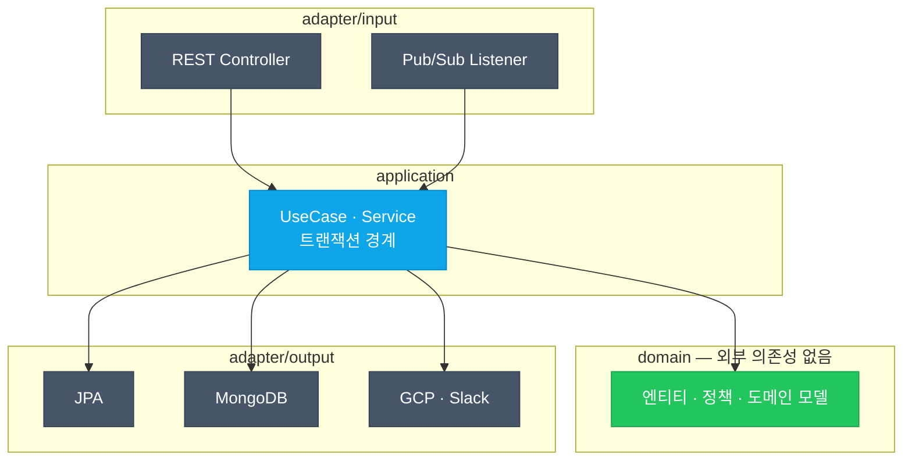

# 아키텍처 상세

## 서비스 구성 (4개 마이크로서비스)

| 서비스 | 기술 | 역할 |
|---|---|---|
| **Frontend** | Next.js 15 / React 19 / TS | 사용자용 웹 (추천·전략·뉴스·종목·마이페이지) |
| **Backoffice** | Next.js 15 / React 19 / TS | 운영자용 관리 화면 (RBAC, 대시보드, 점수 기준 관리) |
| **Core API** | Spring Boot 3.5 / Kotlin 2.1 / Java 21 | 인증·도메인·비즈니스 로직 REST API |
| **Data/ML Engine** | FastAPI / Python 3.11 | 데이터 수집, 전략 분석, ML 예측 |

모든 서비스는 **GCP Cloud Run**(scale-to-zero)에 배포되어 동일한 배포·운영 모델을 공유한다.

## Hexagonal Architecture

Core API와 Data Engine 모두 포트&어댑터 구조를 적용해 도메인을 외부 기술로부터 격리한다.

> 의존성은 항상 **바깥 → 안(domain)** 방향. domain은 프레임워크·DB를 모르므로 순수 단위 테스트가 가능하다.

## 데이터 흐름 — AI 예측 파이프라인

## 데이터 저장소

| 저장소 | 용도 |
|---|---|
| **PostgreSQL** (Supabase) | 사용자, 구독, 권한 등 관계형 데이터 |
| **MongoDB** (Atlas) | 분석 결과, 예측, 거래 이력 등 문서형 데이터 |
| **Caffeine** | 애플리케이션 로컬 캐시 |
| **Pub/Sub** | 서비스 간 비동기 메시지 |

## 인프라 & 운영

- **컴퓨팅**: GCP Cloud Run (4개 서비스, scale-to-zero)
- **IaC**: Terraform (GCP 리소스, 스케줄)
- **CI/CD**: GitHub Actions (`git push` → 자동 빌드·배포)
- **CDN/DNS/WAF**: Cloudflare (Free Plan)
- **모니터링**: Cloud Monitoring (alert/uptime/log metric) → Slack
- **성능**: Core API에 GraalVM Native Image 적용 (시작 ~2초, RSS ~170MB)

## 비용 구조 (월 ~$5)

| 항목 | 비용 |
|---|---|
| Cloud Run (4서비스) | ~$2 (무료 티어 + cpu-throttling) |
| Cloudflare | $0 (Free) |
| Pub/Sub | $0 (무료 티어) |
| 도메인 + Artifact Registry | ~$1.5 |
| Networking + Secret Manager 등 | ~$1.5 |
